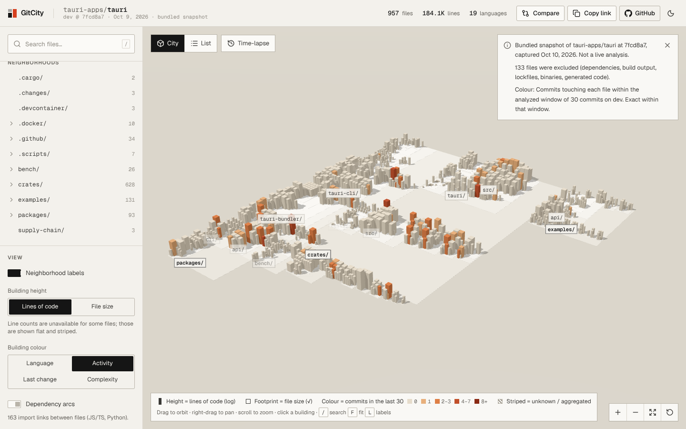
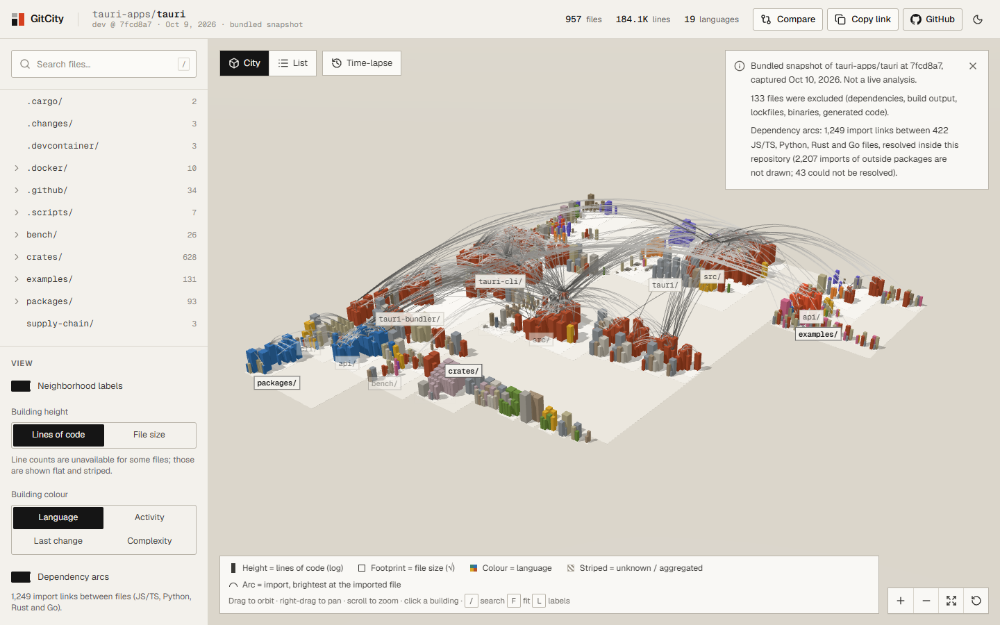
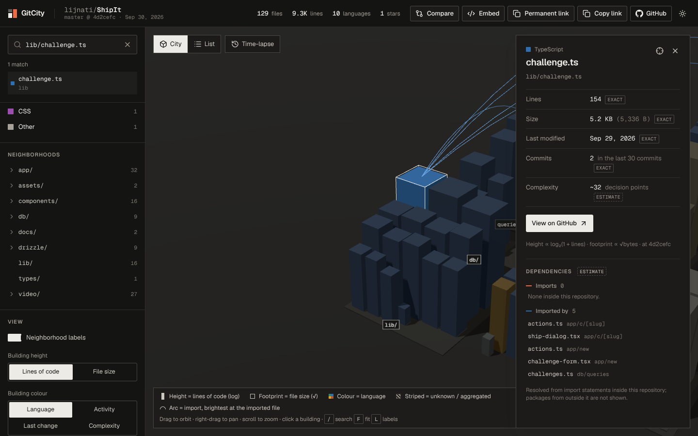
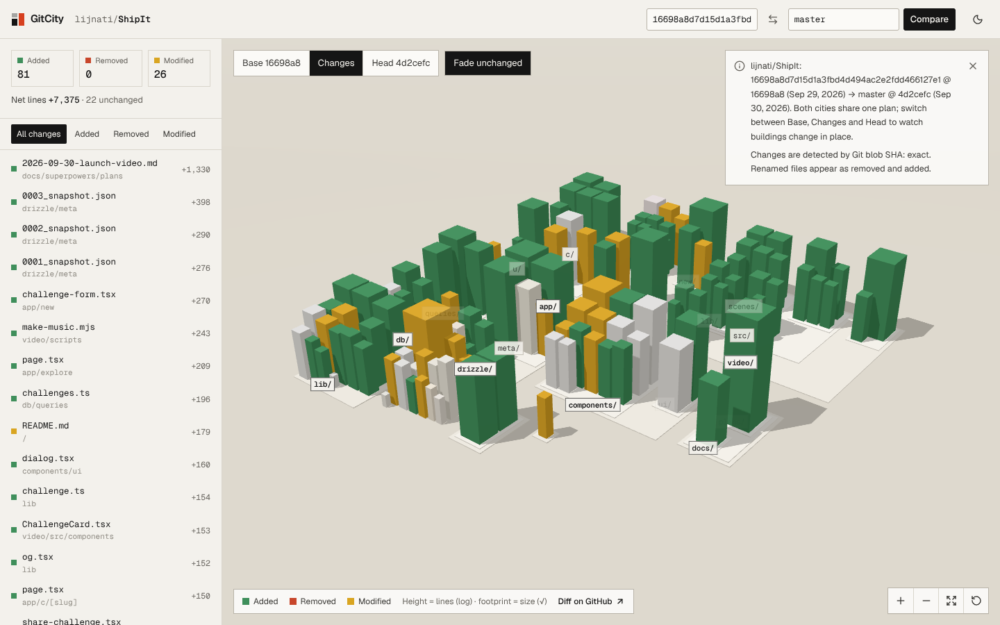
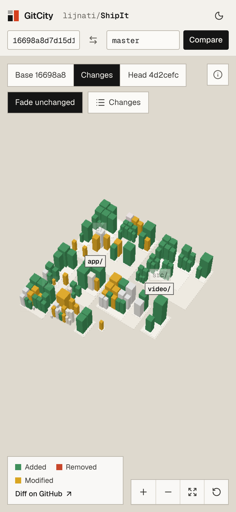
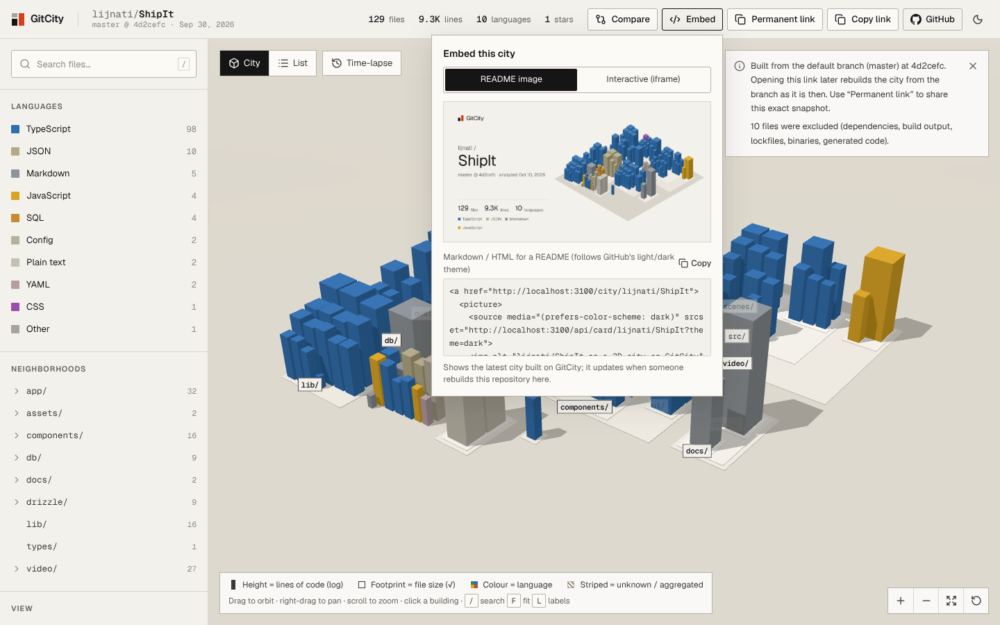

# GitCity

**Every codebase is a city. Explore yours.**

GitCity turns a public GitHub repository into an interactive 3D city. Every building is a source file, every neighborhood is a directory, and every visual property maps to one documented metric. If GitCity can't measure something, it says so instead of guessing.


| Explorer (bundled sample) | Selected file |
| --- | --- |
|  |  |

| Live city (real GitHub analysis) | Real progress stages | Mobile bottom sheet |
| --- | --- | --- |
|  |  |  |

All screenshots were captured from the production build in headless Chromium (SwiftShader WebGL), and are in [`docs/screenshots/`](docs/screenshots).

## Features

- Paste `owner/repo`, `github.com/owner/repo` or any `https://github.com/...` URL. Input is strictly validated and normalized.
- Server-side, bounded analysis of the default branch at an **exact commit SHA**.
- A deterministic 3D city: the same snapshot always produces the same layout.
- Orbit, pan, zoom, fit, reset, and eased camera focus. Hover tooltips. Click a building to see its details and a GitHub link pinned to the analyzed SHA.
- Search, language filters, directory focus, a label toggle, and a height metric toggle (lines vs. size).
- **List view**: an accessible, sortable table with the same data as the 3D scene.
- Mobile-specific model: full-bleed canvas, filter drawer, bottom-sheet details, touch orbit and pinch, and a reduced render budget.
- **Time-lapse:** scrub or play through a repository's history and watch its city grow in place (see [Time-lapse](#time-lapse)).
- **Link previews:** each city has its own 1200×630 preview image, an isometric drawing of its real layout with the repo's stats (see [Link previews](#link-previews)).
- **Colour views:** recolour the city by recent activity, last change or estimated complexity, with an explicit "unavailable" colour (see [Colour views](#colour-views)).
- **Dependency layer:** import links between JS/TS, Python, Rust and Go files drawn as arcs; select a file to see what it imports and what imports it (see [Dependency layer](#dependency-layer)).
- **Compare two cities:** two commits, branches or tags of one repository on one shared plan, with added, removed and modified files highlighted (see [Compare](#compare)).
- **Gallery** of recently built cities, **README image cards** (light and dark) and an **interactive iframe embed** (see [Gallery and embeds](#gallery-and-embeds)).
- **Dark theme**, following the system setting until you pick one with the toggle.
- Shareable URLs: `/city/owner/repo` shows the default branch as it is now, and `/city/owner/repo/<sha>` is a **permanent link** to a saved snapshot that never changes. Both have copy-link actions and per-route metadata.
- Bundled real sample (`/sample`) that works offline. It is clearly labelled as a captured snapshot.

## How repository analysis works

`src/lib/repo/analyze.ts` runs on the server for each request:

1. **Connect.** `GET /repos/{owner}/{repo}` reads the default branch. Private repositories are refused even if the server token could read them.
2. **Revision.** `GET /repos/{o}/{r}/commits/{branch}` resolves the exact SHA. An empty repository (409) gets a friendly empty state.
3. **Structure.** `GET /git/trees/{sha}?recursive=1` returns every path with its **exact blob size**. If GitHub truncates the tree, the UI says so.
4. **Contents.** One streamed tarball of that SHA (`/tarball/{sha}`). The only redirect GitCity follows is to `codeload.github.com`, and credentials are not forwarded. It is gunzipped and read by a minimal streaming tar parser. Line counts and the complexity estimate come from the **real file contents**. Files over 1 MB, binary files, and anything left unread when the size or time budget runs out are marked unavailable, with the reason. This pass costs no per-file API requests.
5. **History.** The last *N* commits on the branch (30 with a token, 5 without), each fetched once for its file list. This gives per-file commit counts and last-change dates **within that window**.
6. **Storage.** Every analysis is saved as a snapshot in a private Vercel Blob store (see [Snapshot storage](#snapshot-storage)). For an hour, any server instance reuses it instead of calling GitHub again. Concurrent requests for the same repository on one instance share one analysis.

Progress is streamed to the browser as NDJSON from `/api/analyze`. Every stage shown is a real pipeline stage; there are no simulated percentages. The browser then reports its own stages: layout, construction, and the first WebGL frame.

### Exclusions

Defaults live in `src/lib/repo/exclusions.ts` (`DEFAULT_EXCLUSIONS`), and you can pass a custom `ExclusionConfig` to `analyzeRepository`. Excluded categories:

- dependency, vendor and build directories (`node_modules`, `vendor`, `dist`, `build`, `.next`, `coverage`, `target`, …)
- lockfiles
- binaries and media
- minified files
- known generated suffixes (`.pb.go`, `_pb2.py`, …)
- files whose first 2 KB contain an `@generated` or `DO NOT EDIT` marker
- symlinks

Excluded files are counted by reason and the count is shown.

## Snapshot storage

`src/lib/snapshot-store.ts` stores each analysis in a **private** Vercel Blob store. It holds only metadata about public repositories, never file contents.

| Path | Purpose | Mutability |
| --- | --- | --- |
| `snapshots/{owner}/{repo}/{sha}.json` | Backs the permanent link `/city/owner/repo/{sha}` | Write-once: the first analysis of a commit is kept forever |
| `latest/{owner}/{repo}.json` | Pointer to the newest default-branch analysis (with a small summary for the gallery); serves as the shared cache | Overwritten on each new default-branch analysis |
| `timelapse/{owner}/{repo}/{headSha}.json` | A sampled time-lapse ending at that commit | Write-once |

`/city/owner/repo` reuses the latest stored analysis for an hour, then re-analyzes the default branch. Requests with a SHA (`?sha=`) are served from storage only and never trigger an analysis. Requests with a `ref` (branch, tag or commit, used by Compare) resolve it to a commit, reuse a stored analysis of that commit if one exists, and otherwise analyze it and store it write-once — without moving the `latest` pointer. If storage is unavailable, the city still renders, but without a permanent link.

## Time-lapse


**What it shows.** The **Time-lapse** button (or `?timelapse=1` on any city URL) samples up to **16 commits evenly across the default branch's history**, oldest first, ending exactly at the commit on screen.

**Truthful by construction:**

- **Heights show file size during the time-lapse.** Each frame is one Git tree read, so sizes are exact. Past commits have no line counts, because reading every frame's contents would multiply the cost by the repository size. The UI says so.
- **The city grows in place.** `buildTimelapseCity` (`src/lib/city/timelapse.ts`) lays out the union of all files once, with each slot sized for that file's largest version. Frames only change heights, footprints and visibility, so buildings never move or overlap.
- **Path-based tracking.** Renamed files appear as removed and added. Generated-code markers need file contents, so they aren't applied to frames.

**Cost.** About `2 × frames + 3` GitHub API requests per new time-lapse; for comparison, a full city analysis needs about 9 without a token. Building one requires `GITHUB_TOKEN` on the server; without it, the UI explains that the time-lapse is unavailable. It is limited to 3 per IP per 10 minutes per instance. Results are stored write-once in Blob as `timelapse/{owner}/{repo}/{headSha}.json`, so a repeat costs nothing.

**Sampling.** GitHub's commit list includes commits merged in from other branches; there is no first-parent option. The `/sample` time-lapse is bundled (built with `pnpm sample:timelapse` from a local clone using the same sampling and filtering), so it needs no API access.

## Colour views



**Building colour** in the sidebar switches from language to one measured value, bucketed onto one sequential ramp (`src/lib/city/color-views.ts`):

| View | Value | Buckets | Unavailable when |
| --- | --- | --- | --- |
| Activity | Commits touching the file in the analyzed window | 0 · 1 · 2–3 · 4–7 · 8+ | No commit window was analyzed |
| Last change | Last commit touching the file in the window | "older" (not touched in the window: exact date unknown) + four equal time spans of the window | No commit window |
| Complexity | Keyword-based decision points (an estimate) | ≤5 · 6–10 · 11–25 · 26–50 · 51+ | Unsupported language, or contents not read |

A file without a value gets a neutral "unavailable" colour, never a guessed bucket. Aggregate blocks keep their neutral colour, since a mix of files has no single value. The legend and the notes say what the colour measures.

## Dependency layer



Turn on **Dependency arcs** in the sidebar to draw every resolved import as an arc from the importing building to the imported one. Each arc brightens toward the imported file, so direction reads without arrowheads. Select a building to draw only its own arcs (orange: what it imports; blue: what imports it); the detail panel lists both, and each entry jumps to that file.



**How imports are found** (`src/lib/repo/imports.ts`), during the same single tarball read that counts lines:

- **JavaScript / TypeScript** (including Vue and Svelte files): `import … from`, `export … from`, side-effect `import "x"`, `require()` and dynamic `import()`, after stripping comments. Resolution follows relative paths with extension and `index` probing (and `.js` → `.ts` for ESM TypeScript), the nearest `tsconfig.json`/`jsconfig.json` `baseUrl` and `paths`, and packages of the same repository by their `package.json` name (workspaces).
- **Python:** `import a.b` and `from … import …`, including relative imports, resolved from the file's package, the repository root, `src/`, and the directory above the file's outermost package.
- **Rust:** `mod x;` declarations and `use` trees (`use a::{b::C, d::{self, E}}`, `pub use`, `extern crate`), after stripping comments (including nested block comments) and string literals.
  - `mod x;` resolves to `x.rs` or `x/mod.rs`: next to the file for `lib.rs`, `main.rs`, `mod.rs` and Cargo's auto-discovered crate roots (files directly in `tests/`, `examples/`, `benches/` or `src/bin/` of a package, and `build.rs`), otherwise in `<dir>/<stem>/`. So `mod common;` in `tests/test_x.rs` finds `tests/common/mod.rs`.
  - `crate::`, `super::` and `self::` paths walk the module tree. The crate root is `src/lib.rs` (or `src/main.rs`) next to the nearest `Cargo.toml`. A path links to the **deepest module file that exists along it**: `use crate::config::Config` links to `config.rs`, and `use crate::Error` links to `lib.rs`, where the item must be declared. `self`/`super` inside an inline `mod tests { … }` are relative to that inline module, so `use super::*` in a test module stays inside its own file.
  - A path that starts with a module or type declared in the same file (`mod config; pub use config::Config;`) resolves from that file.
  - A path that starts with another crate resolves into that crate's root when a `Cargo.toml` in the repository declares it as `[package] name` (with `-` read as `_`). Only that key is read, with a line-based parser. `std`, `core`, `alloc` and every other crate are external.
- **Go:** single-line and grouped `import ( … )` declarations, with aliases, `_` and `.` imports. An import path under a `module` declared in a `go.mod` of the repository (the longest matching module wins, so nested modules work) resolves to that package directory. **An import links to every non-test `.go` file in the package**, sorted by path, and counts as one resolved import: Go imports a whole package, so GitCity doesn't pick a single "representative" file. A package directory with no included non-test file counts as unresolved. The standard library and every other module are external.
- Imports of packages outside the repository are counted, not drawn. Imports that point inside the repository but match no included file (for example a generated or excluded file) are counted as unresolved. Nothing is guessed, and the detail panel labels the result an **estimate**: extraction is lexical, not a full parse, and `tsconfig` `extends` chains are not followed.
- Each stored graph records which languages it scanned. Snapshots analyzed before Rust and Go support show no Rust/Go dependency section (rather than a false "none") and the notes offer a rebuild.

On the bundled tauri sample, Rust support takes the dependency layer from 163 import links (97 JS/TS files scanned) to 1,249 (422 files): 2,576 resolved imports, 2,207 external, 43 unresolved. The 4 unresolved Rust imports point at directories the exclusion rules drop (`build/`, `vendor/`) or at `[[bin]]` targets declared by path in `Cargo.toml`.

**Budget:** up to 4,000 building links are drawn at once on desktop (1,500 on mobile) in one draw call; selecting a building always shows all of its own. Snapshots stored before this layer existed say so and offer a rebuild instead of showing an empty layer.

## Compare



`/compare/owner/repo?base=<ref>&head=<ref>` (or **Compare** in a city's top bar) builds both cities and draws them on **one shared plan**: the union of their files, each slot sized for the larger version (`src/lib/city/compare.ts`). **Base**, **Changes** and **Head** switch between them and buildings change height and footprint in place. Added files are green, removed files red, modified files amber; **Fade unchanged** dims the rest. The side panel lists every change with its line delta, and a selected file shows its lines and size on both sides.

- **Exact change detection:** analyses record each file's Git blob SHA, so "modified" means the content changed. Snapshots stored before blob SHAs were recorded fall back to size and line count, and the notes say so (edits that keep both identical are then missed).
- Refs are validated (`isValidRef`) and only ever used as one encoded URL path segment.
- Renamed files appear as removed and added.

| Mobile |
| --- |
|  |

## Gallery and embeds

- **`/gallery`** lists the 48 most recently built default-branch cities, newest first, each with its card image, languages and stats, linking to its permanent snapshot. It is regenerated at most every 5 minutes. Set `GALLERY_EXCLUDE` (comma-separated `owner/repo` or `owner`) to hide entries, for example on request.
- **README card:** `/api/card/owner/repo` returns a PNG of the latest stored city (`?sha=` pins a saved one, `?theme=dark` matches dark READMEs). The **Embed** menu gives a ready `<picture>` snippet that follows GitHub's light/dark theme. Cards are cached at the edge and never start an analysis.
- **Interactive embed:** `/embed/owner/repo` (optionally `?sha=`) is a minimal orbit-and-zoom city for iframes, with a link back to the full explorer. Only `/embed/*` may be framed (`Content-Security-Policy: frame-ancestors *`); every other page sends `X-Frame-Options: DENY`.



## Dark theme

The toggle in the header switches between light and dark; without a choice, GitCity follows the system setting. A tiny inline script applies the theme before first paint (no flash), and the 3D scene, preview cards and gallery switch palettes with it (`src/lib/city/palette.ts`). Language and data colours stay the same in both themes.

## Link previews

Every city route has an `opengraph-image`. `src/lib/og/iso-city.ts` draws the city's actual layout as a flat-shaded isometric SVG: same layout engine, heights and palette as the 3D scene, capped at 1,500 buildings. `src/lib/og/city-card.tsx` places it on a card with the repo name, revision and stats.

- **Built from saved snapshots only.** Rendering a preview never triggers a GitHub analysis, since social crawlers would otherwise burn the rate limit. A repository that hasn't been analyzed yet gets a plain card with an empty lot marked "Not built yet".
- **Caching:** a saved-snapshot preview is cached as immutable. The latest-city preview is cached for 1 hour at the edge.

## Metric definitions

| Visual | Metric | Provenance | Mapping |
| --- | --- | --- | --- |
| Building | One included file | exact | — |
| Height | Lines of code | **exact** (counted from contents) or **unavailable** | `0.5 + 1.9·log₂(1 + lines)` |
| Height (alt. toggle) | File size | exact | `0.5 + 1.9·log₂(1 + bytes/40)` |
| Footprint | File size (bytes from the Git tree) | exact | `clamp(0.8 + 0.5·√(bytes/100), 1, 5.5)` |
| Colour | Language (from file name/extension) | derived | curated palette, `src/lib/repo/languages.ts` |
| Neighborhood | Directory | exact | nested plinths, bottom-up packing |
| Stripes | Lines unavailable, or an aggregated block | — | flat, hatched: a cue that doesn't rely on colour |

Further metrics in the detail panel:

- **Lines.** The number of `\n` characters, plus one if the file doesn't end with a newline. An empty file has 0 lines.
- **Commits / last change.** Exact within the analysed window ("in the last 30 commits"). Files untouched in the window show "not changed since <date>", not a made-up date. Matching is by path, so a file renamed inside the window is counted under its new name only.
- **Complexity (estimate).** `1 +` the number of branching keywords (`if`, `for`, `while`, `case`, `catch`, …) and `&&`/`||`, counted after a light lexer strips comments and strings. Only C-family, JS/TS, Go, Rust, Java, Kotlin, Swift, Python, Ruby and Shell are covered. It is always labelled as an estimate and never drives geometry.

Byte size is **never** used in place of a missing line count.

## City generation

`src/lib/city/` is pure TypeScript with no React, and it is unit-tested:

```
RepoSnapshot → applyBudget (aggregation) → directory tree → bottom-up shelf packing → instance buffers → scene
```

- Each directory block packs its own files into one lot, then packs that lot together with its child blocks. Streets between blocks get narrower with depth. Because a block's size is derived from its packed contents, overlap is impossible by construction. Tests check this anyway.
- All ordering uses byte-wise path comparison. There is no randomness and no use of time.
- **Rendering budget.** The limit is 5,000 buildings on desktop and 2,000 on mobile. Above that, the largest files (by exact size) stay individual. The rest are merged into one flat, striped aggregate block per directory. The UI states how many files were merged, and every file remains in search and the list view.

The 3D scene uses two instanced meshes for buildings (solid, and striped) and one for plinths, so the city takes about 6 draw calls whatever the repository size. Other scene details:

- `frameloop="demand"`
- device-pixel-ratio caps (1.75 desktop, 1.5 mobile)
- no shadows on mobile
- explicit disposal of geometries, materials and textures
- near/far planes that follow the camera distance

Labels are a plain DOM layer, positioned each frame. A label is shown only when its block is wide enough on screen and doesn't collide with a higher-priority label.

## Local development

Requirements: Node ≥ 20.9 (developed on 22) and pnpm 10.

```bash
pnpm install
cp .env.example .env.local     # optional: add GITHUB_TOKEN
pnpm dev                       # http://localhost:3000
```

| Command | What it does |
| --- | --- |
| `pnpm typecheck` | `tsc --noEmit` (strict) |
| `pnpm lint` | ESLint (Next core-web-vitals + TypeScript) |
| `pnpm test` | Vitest: unit, integration (mocked GitHub) and component tests; no network |
| `pnpm build` / `pnpm start` | Production build / server |
| `pnpm e2e` | Builds, then runs Playwright on desktop and Pixel 7 (touch) projects |
| `pnpm verify` | typecheck + lint + test + build |
| `pnpm sample <clone> <owner> <repo> [description]` | Regenerates `src/data/sample-city.json` from a local clone |

### Environment variables

| Variable | Required | Purpose |
| --- | --- | --- |
| `GITHUB_TOKEN` | No (recommended) | Server-only token; no scopes needed for public repos. Raises the API limit from 60 to 5,000 requests per hour and widens the commit window from 5 to 30. It is never sent to the browser. |
| `NEXT_PUBLIC_SITE_URL` | No | Absolute base URL for metadata (`metadataBase`). Falls back to the Vercel production URL. |
| `GALLERY_EXCLUDE` | No | Comma-separated `owner/repo` or `owner` entries hidden from the gallery. |
| `BLOB_READ_WRITE_TOKEN` | No (recommended in production) | Vercel Blob token; set automatically when a Blob store is connected to the project. Enables saved snapshots, permanent links and the cross-instance cache. Without it, snapshots live in memory and disappear with the instance. |

Each uncached analysis costs about 3 API requests, plus 1 tarball download and *N* + 1 history requests.

## Security

- Repository identifiers are validated with strict owner/name grammars. Only `github.com` URLs are accepted. Credentials, ports, other schemes and path traversal are rejected.
- The server only contacts `api.github.com`, plus a redirect to `codeload.github.com` that it checks before following. Every path is built from validated segments with `encodeURIComponent`. A user-supplied URL is never fetched.
- JSON responses are capped (5 MB, or 40 MB for trees) and validated with zod. Tarball reads are capped at 80 MB compressed and 400 MB inflated, with a 25 s budget. Each request has a 10 s timeout.
- Repository code is only scanned as bytes. It is never executed.
- `/api/analyze` is rate-limited per IP: a per-instance limit on uncached analyses (12 per 10 minutes), plus a project-wide Vercel Firewall rule that is shared by all instances (see [Deployment](#deployment)).
- Security headers are set in `next.config.ts`. Only `/embed/*` may be framed by other sites.
- The dependency layer reads imports as text; nothing from an analyzed repository is executed or fetched.

## Testing

- **Unit:** input parsing (valid, invalid and malicious), exclusions, languages, line counting, complexity, tar parsing at many chunk sizes, scale functions, layout determinism, non-overlap, containment, stable file→building mapping, budget aggregation, cache and rate limiter.
- **Integration (mocked GitHub):** a full analysis, plus these cases: 404 or private, private-flag refusal, empty repository, rate limits (403/429 with reset), 5xx, network failure, timeout, truncated tree, tarball failure, a redirect to a foreign host, oversized files, content budget, a rate-limited history call, the no-token window, file limits, and a 20k-file tree.
- **Component:** detail-panel unavailable states, aggregates, sidebar search/filter, and the filter model.
- **Features:** import extraction and resolution (JS/TS forms, tsconfig paths, workspaces, Python relative/absolute, Rust `mod` layouts, `crate`/`super`/`self` paths, inline test modules and workspace crates, Go grouped imports, module prefixes, nested modules and externals), the Rust/Go dependency section on old snapshots, colour-view bucketing and unavailable states, compare classification (blob SHA and fallback) and shared-plan frames, building-level edges, ref validation, gallery listing, the `ref` analysis path (no `latest` move) and the README card route.
- **E2E (Playwright, desktop + Pixel 7):** colour views, dependency arcs and the detail-panel import lists, theme toggle persistence, compare (mocked analyses, change list, Base/Head switching, invalid refs refused client-side), gallery, embed snippets, frame headers, and earlier: landing, validation, URL normalisation with mocked progress, error states, 404, search → detail panel, clicking a building, language filter + list view + sorting, camera controls and shortcuts, directory focus, touch orbit + tap-to-select + bottom sheet, the filter drawer, no horizontal overflow, and zero console errors.

## Known limitations

- **Permanent links cover analyzed commits only.** A `/city/owner/repo/<sha>` link exists once GitCity has analyzed that commit (as the default-branch head, or as one side of a comparison).
- **Commit activity is window-based**, by design, to bound API usage. GitHub returns at most 300 files per commit; when that limit is hit, the window is flagged as partial.
- **Very large repositories.** More than 60,000 included source files are refused. Tarballs above the budget yield partial line counts, and this is disclosed. GitHub truncates trees above about 100k entries, and this is also disclosed.
- **The per-IP analysis limit is per instance.** Cross-instance abuse protection comes from the Vercel Firewall rule. Without it (e.g. on another host), add an edge rate limiter.
- **Language detection** uses file names and extensions, not content.
- **Complexity** is a lexical estimate, not a parsed metric.
- **UI primitives.** The shadcn/ui registry wasn't reachable from the development sandbox, so `src/components/ui/` contains hand-written components in the same pattern (cva + tailwind-merge).
- **Link previews** show the latest analysis stored at the time a crawler fetches them. Use the permanent link to share an exact snapshot.
- **Dependency arcs** cover JavaScript/TypeScript, Python, Rust and Go. Extraction is lexical; `tsconfig` `extends` and bundler-specific aliases are not followed.
- **Rust:** only `[package] name` is read from `Cargo.toml`. Not followed: `#[path = "…"]` attributes, `[lib]`/`[[bin]]` `path` and `name` overrides (a `mod` in a `[[bin]]` root outside `src/main.rs` counts as unresolved), renamed dependencies (`foo = { package = "bar" }`), modules generated by macros or `build.rs`, and 2015-edition paths without `crate::`. `crate::` in `tests/`, `examples/`, `benches/` and `src/bin/` files resolves against the package's library or main root. Paths written inline in expressions (`crate::a::f()`) are not imports and are not read.
- **Go:** build tags and `//go:build` constraints are ignored (every non-test file in the package is linked), as are `replace` directives and `vendor/`.
- **Compare and Embed menus** are in the desktop top bar; on phones, open `/compare/owner/repo` directly.
- **The gallery is unmoderated:** it lists any public repository someone built. Use `GALLERY_EXCLUDE` to hide one.

## Deployment

GitCity is a standard Next.js 16 app with Node.js route handlers, so it can be deployed to Vercel or any Node host:

1. Import the repository and set `GITHUB_TOKEN` (and `NEXT_PUBLIC_SITE_URL` to the public domain).
2. Use the build command `pnpm build`. Uncached analyses take about 5–30 s, so allow at least 60 s for functions (`maxDuration = 60` is set on the route).
3. Create a private Vercel Blob store and connect it to the project; this sets `BLOB_READ_WRITE_TOKEN`.
4. Add a Vercel Firewall rate-limit rule on `/api/analyze` and `/api/timelapse` (for example 30 requests per 60 s per IP).

Production: <https://gitcity.xylolabs.space>.

## Project structure

```
src/
  app/                    routes: / · /sample · /city/[owner]/[repo] · /api/analyze
  components/scene/       R3F scene (instanced buildings, plinths, labels, camera rig)
  components/explorer/    explorer shell, sidebar, detail panel, list view, loader, errors
  components/landing/     repo form, live preview
  components/ui/          button, input, switch, kbd (shadcn pattern)
  lib/github/             GitHub client + zod schemas
  lib/repo/               input parsing, exclusions, languages, tar reader, metrics, analysis
  lib/city/               budget, layout, scale (pure, deterministic)
  data/sample-city.json   bundled snapshot of tauri-apps/tauri (metadata only)
tests/                    unit, integration, component tests (Vitest)
e2e/                      Playwright specs
scripts/build-sample.ts   sample generator
```

## License

MIT
