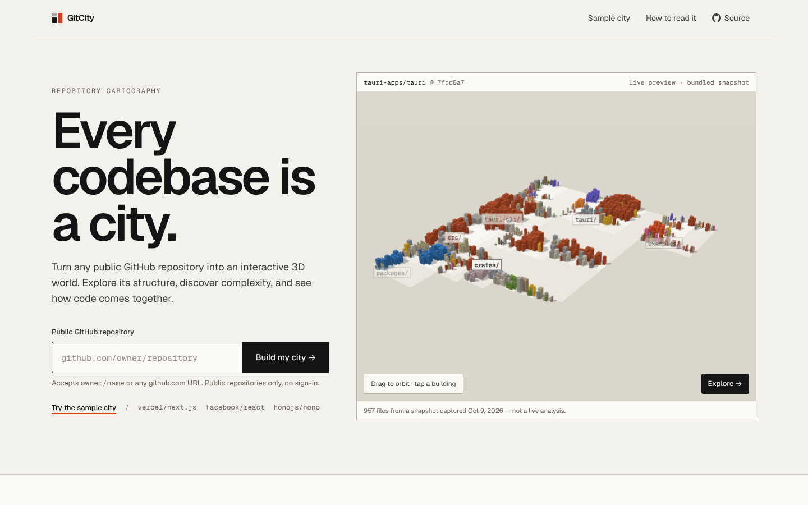
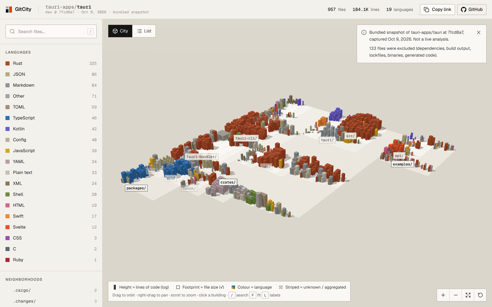
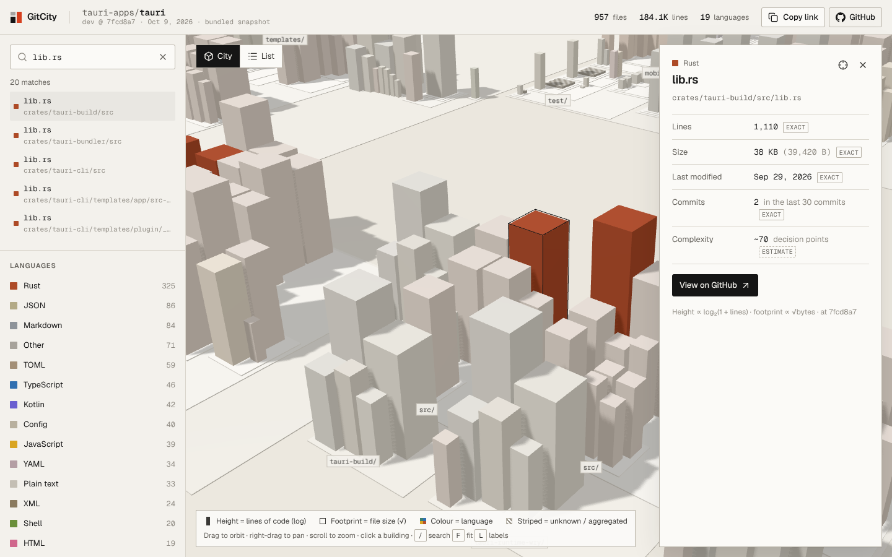
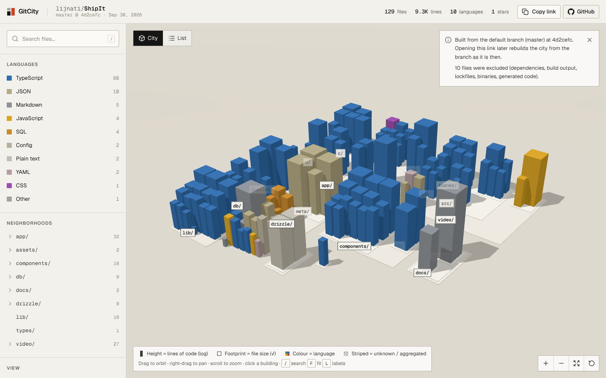
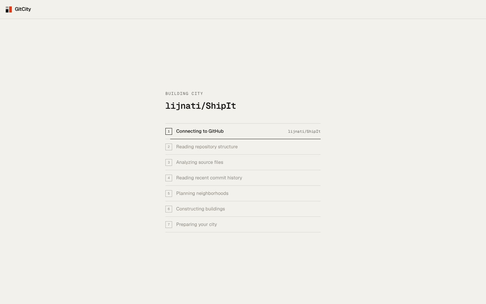
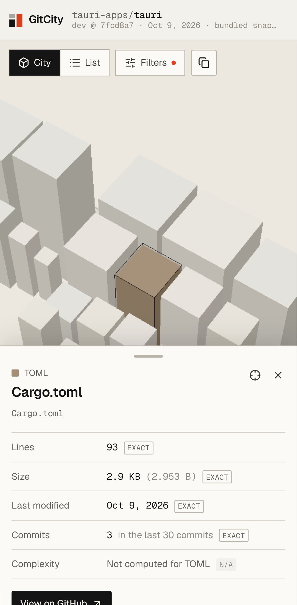
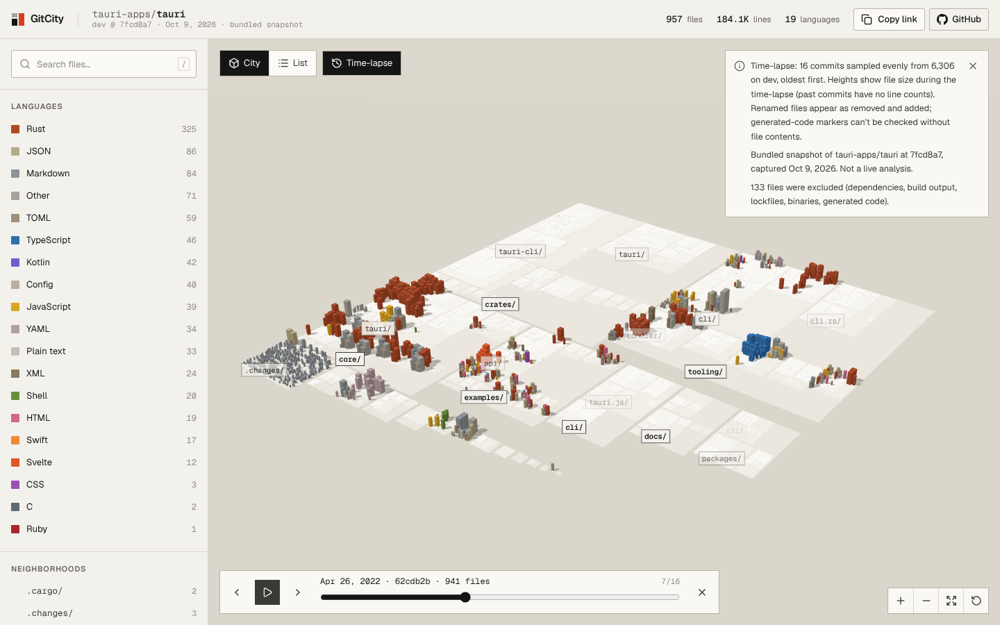

# GitCity

**Every codebase is a city. Explore yours.**

GitCity turns a public GitHub repository into an interactive 3D city. Every building is a source file, every neighborhood is a directory, and every visual property maps to one documented metric. If GitCity can't measure something, it says so instead of guessing.



| Explorer (bundled sample) | Selected file |
| --- | --- |
|  |  |

| Live city (real GitHub analysis) | Real progress stages | Mobile bottom sheet |
| --- | --- | --- |
|  |  |  |

All screenshots were captured from the production build in headless Chromium (SwiftShader WebGL), and are in [`docs/screenshots/`](docs/screenshots).

## Features

- Paste `owner/repo`, `github.com/owner/repo` or any `https://github.com/...` URL. Input is strictly validated and normalized.
- Server-side, bounded analysis of the default branch at an **exact commit SHA**.
- A deterministic 3D city: the same snapshot always produces the same layout.
- Orbit, pan, zoom, fit, reset, and eased camera focus. Hover tooltips. Click a building to see its details and a GitHub link pinned to the analyzed SHA.
- Search, language filters, directory focus, a label toggle, and a height metric toggle (lines vs. size).
- **List view**: an accessible, sortable table with the same data as the 3D scene.
- Mobile-specific model: full-bleed canvas, filter drawer, bottom-sheet details, touch orbit and pinch, and a reduced render budget.
- **Time-lapse:** scrub or play through a repository's history and watch its city grow in place (see [Time-lapse](#time-lapse)).
- **Link previews:** each city has its own 1200×630 preview image, an isometric drawing of its real layout with the repo's stats (see [Link previews](#link-previews)).
- Shareable URLs: `/city/owner/repo` shows the default branch as it is now, and `/city/owner/repo/<sha>` is a **permanent link** to a saved snapshot that never changes. Both have copy-link actions and per-route metadata.
- Bundled real sample (`/sample`) that works offline. It is clearly labelled as a captured snapshot.

## How repository analysis works

`src/lib/repo/analyze.ts` runs on the server for each request:

1. **Connect.** `GET /repos/{owner}/{repo}` reads the default branch. Private repositories are refused even if the server token could read them.
2. **Revision.** `GET /repos/{o}/{r}/commits/{branch}` resolves the exact SHA. An empty repository (409) gets a friendly empty state.
3. **Structure.** `GET /git/trees/{sha}?recursive=1` returns every path with its **exact blob size**. If GitHub truncates the tree, the UI says so.
4. **Contents.** One streamed tarball of that SHA (`/tarball/{sha}`). The only redirect GitCity follows is to `codeload.github.com`, and credentials are not forwarded. It is gunzipped and read by a minimal streaming tar parser. Line counts and the complexity estimate come from the **real file contents**. Files over 1 MB, binary files, and anything left unread when the size or time budget runs out are marked unavailable, with the reason. This pass costs no per-file API requests.
5. **History.** The last *N* commits on the branch (30 with a token, 5 without), each fetched once for its file list. This gives per-file commit counts and last-change dates **within that window**.
6. **Storage.** Every analysis is saved as a snapshot in a private Vercel Blob store (see [Snapshot storage](#snapshot-storage)). For an hour, any server instance reuses it instead of calling GitHub again. Concurrent requests for the same repository on one instance share one analysis.

Progress is streamed to the browser as NDJSON from `/api/analyze`. Every stage shown is a real pipeline stage; there are no simulated percentages. The browser then reports its own stages: layout, construction, and the first WebGL frame.

### Exclusions

Defaults live in `src/lib/repo/exclusions.ts` (`DEFAULT_EXCLUSIONS`), and you can pass a custom `ExclusionConfig` to `analyzeRepository`. Excluded categories:

- dependency, vendor and build directories (`node_modules`, `vendor`, `dist`, `build`, `.next`, `coverage`, `target`, …)
- lockfiles
- binaries and media
- minified files
- known generated suffixes (`.pb.go`, `_pb2.py`, …)
- files whose first 2 KB contain an `@generated` or `DO NOT EDIT` marker
- symlinks

Excluded files are counted by reason and the count is shown.

## Snapshot storage

`src/lib/snapshot-store.ts` stores each analysis in a **private** Vercel Blob store. It holds only metadata about public repositories, never file contents.

| Path | Purpose | Mutability |
| --- | --- | --- |
| `snapshots/{owner}/{repo}/{sha}.json` | Backs the permanent link `/city/owner/repo/{sha}` | Write-once: the first analysis of a commit is kept forever |
| `latest/{owner}/{repo}.json` | Pointer to the newest analysis; serves as the shared cache | Overwritten on each new analysis |

`/city/owner/repo` reuses the latest stored analysis for an hour, then re-analyzes the default branch. Requests with a SHA (`?sha=`) are served from storage only and never trigger an analysis. If storage is unavailable, the city still renders, but without a permanent link.

## Time-lapse



**What it shows.** The **Time-lapse** button (or `?timelapse=1` on any city URL) samples up to **16 commits evenly across the default branch's history**, oldest first, ending exactly at the commit on screen.

**Truthful by construction:**

- **Heights show file size during the time-lapse.** Each frame is one Git tree read, so sizes are exact. Past commits have no line counts, because reading every frame's contents would multiply the cost by the repository size. The UI says so.
- **The city grows in place.** `buildTimelapseCity` (`src/lib/city/timelapse.ts`) lays out the union of all files once, with each slot sized for that file's largest version. Frames only change heights, footprints and visibility, so buildings never move or overlap.
- **Path-based tracking.** Renamed files appear as removed and added. Generated-code markers need file contents, so they aren't applied to frames.

**Cost.** About `2 × frames + 3` GitHub API requests per new time-lapse; for comparison, a full city analysis needs about 9 without a token. Building one requires `GITHUB_TOKEN` on the server; without it, the UI explains that the time-lapse is unavailable. It is limited to 3 per IP per 10 minutes per instance. Results are stored write-once in Blob as `timelapse/{owner}/{repo}/{headSha}.json`, so a repeat costs nothing.

**Sampling.** GitHub's commit list includes commits merged in from other branches; there is no first-parent option. The `/sample` time-lapse is bundled (built with `pnpm sample:timelapse` from a local clone using the same sampling and filtering), so it needs no API access.

## Link previews

Every city route has an `opengraph-image`. `src/lib/og/iso-city.ts` draws the city's actual layout as a flat-shaded isometric SVG: same layout engine, heights and palette as the 3D scene, capped at 1,500 buildings. `src/lib/og/city-card.tsx` places it on a card with the repo name, revision and stats.

- **Built from saved snapshots only.** Rendering a preview never triggers a GitHub analysis, since social crawlers would otherwise burn the rate limit. A repository that hasn't been analyzed yet gets a plain card with an empty lot marked "Not built yet".
- **Caching:** a saved-snapshot preview is cached as immutable. The latest-city preview is cached for 1 hour at the edge.

## Metric definitions

| Visual | Metric | Provenance | Mapping |
| --- | --- | --- | --- |
| Building | One included file | exact | — |
| Height | Lines of code | **exact** (counted from contents) or **unavailable** | `0.5 + 1.9·log₂(1 + lines)` |
| Height (alt. toggle) | File size | exact | `0.5 + 1.9·log₂(1 + bytes/40)` |
| Footprint | File size (bytes from the Git tree) | exact | `clamp(0.8 + 0.5·√(bytes/100), 1, 5.5)` |
| Colour | Language (from file name/extension) | derived | curated palette, `src/lib/repo/languages.ts` |
| Neighborhood | Directory | exact | nested plinths, bottom-up packing |
| Stripes | Lines unavailable, or an aggregated block | — | flat, hatched: a cue that doesn't rely on colour |

Further metrics in the detail panel:

- **Lines.** The number of `\n` characters, plus one if the file doesn't end with a newline. An empty file has 0 lines.
- **Commits / last change.** Exact within the analysed window ("in the last 30 commits"). Files untouched in the window show "not changed since <date>", not a made-up date. Matching is by path, so a file renamed inside the window is counted under its new name only.
- **Complexity (estimate).** `1 +` the number of branching keywords (`if`, `for`, `while`, `case`, `catch`, …) and `&&`/`||`, counted after a light lexer strips comments and strings. Only C-family, JS/TS, Go, Rust, Java, Kotlin, Swift, Python, Ruby and Shell are covered. It is always labelled as an estimate and never drives geometry.

Byte size is **never** used in place of a missing line count.

## City generation

`src/lib/city/` is pure TypeScript with no React, and it is unit-tested:

```
RepoSnapshot → applyBudget (aggregation) → directory tree → bottom-up shelf packing → instance buffers → scene
```

- Each directory block packs its own files into one lot, then packs that lot together with its child blocks. Streets between blocks get narrower with depth. Because a block's size is derived from its packed contents, overlap is impossible by construction. Tests check this anyway.
- All ordering uses byte-wise path comparison. There is no randomness and no use of time.
- **Rendering budget.** The limit is 5,000 buildings on desktop and 2,000 on mobile. Above that, the largest files (by exact size) stay individual. The rest are merged into one flat, striped aggregate block per directory. The UI states how many files were merged, and every file remains in search and the list view.

The 3D scene uses two instanced meshes for buildings (solid, and striped) and one for plinths, so the city takes about 6 draw calls whatever the repository size. Other scene details:

- `frameloop="demand"`
- device-pixel-ratio caps (1.75 desktop, 1.5 mobile)
- no shadows on mobile
- explicit disposal of geometries, materials and textures
- near/far planes that follow the camera distance

Labels are a plain DOM layer, positioned each frame. A label is shown only when its block is wide enough on screen and doesn't collide with a higher-priority label.

## Local development

Requirements: Node ≥ 20.9 (developed on 22) and pnpm 10.

```bash
pnpm install
cp .env.example .env.local     # optional: add GITHUB_TOKEN
pnpm dev                       # http://localhost:3000
```

| Command | What it does |
| --- | --- |
| `pnpm typecheck` | `tsc --noEmit` (strict) |
| `pnpm lint` | ESLint (Next core-web-vitals + TypeScript) |
| `pnpm test` | Vitest: unit, integration (mocked GitHub) and component tests; no network |
| `pnpm build` / `pnpm start` | Production build / server |
| `pnpm e2e` | Builds, then runs Playwright on desktop and Pixel 7 (touch) projects |
| `pnpm verify` | typecheck + lint + test + build |
| `pnpm sample <clone> <owner> <repo> [description]` | Regenerates `src/data/sample-city.json` from a local clone |

### Environment variables

| Variable | Required | Purpose |
| --- | --- | --- |
| `GITHUB_TOKEN` | No (recommended) | Server-only token; no scopes needed for public repos. Raises the API limit from 60 to 5,000 requests per hour and widens the commit window from 5 to 30. It is never sent to the browser. |
| `NEXT_PUBLIC_SITE_URL` | No | Absolute base URL for metadata (`metadataBase`). |
| `BLOB_READ_WRITE_TOKEN` | No (recommended in production) | Vercel Blob token; set automatically when a Blob store is connected to the project. Enables saved snapshots, permanent links and the cross-instance cache. Without it, snapshots live in memory and disappear with the instance. |

Each uncached analysis costs about 3 API requests, plus 1 tarball download and *N* + 1 history requests.

## Security

- Repository identifiers are validated with strict owner/name grammars. Only `github.com` URLs are accepted. Credentials, ports, other schemes and path traversal are rejected.
- The server only contacts `api.github.com`, plus a redirect to `codeload.github.com` that it checks before following. Every path is built from validated segments with `encodeURIComponent`. A user-supplied URL is never fetched.
- JSON responses are capped (5 MB, or 40 MB for trees) and validated with zod. Tarball reads are capped at 80 MB compressed and 400 MB inflated, with a 25 s budget. Each request has a 10 s timeout.
- Repository code is only scanned as bytes. It is never executed.
- `/api/analyze` is rate-limited per IP: a per-instance limit on uncached analyses (12 per 10 minutes), plus a project-wide Vercel Firewall rule that is shared by all instances (see [Deployment](#deployment)).
- Security headers are set in `next.config.ts`.

## Testing

- **Unit:** input parsing (valid, invalid and malicious), exclusions, languages, line counting, complexity, tar parsing at many chunk sizes, scale functions, layout determinism, non-overlap, containment, stable file→building mapping, budget aggregation, cache and rate limiter.
- **Integration (mocked GitHub):** a full analysis, plus these cases: 404 or private, private-flag refusal, empty repository, rate limits (403/429 with reset), 5xx, network failure, timeout, truncated tree, tarball failure, a redirect to a foreign host, oversized files, content budget, a rate-limited history call, the no-token window, file limits, and a 20k-file tree.
- **Component:** detail-panel unavailable states, aggregates, sidebar search/filter, and the filter model.
- **E2E (Playwright, desktop + Pixel 7):** landing, validation, URL normalisation with mocked progress, error states, 404, search → detail panel, clicking a building, language filter + list view + sorting, camera controls and shortcuts, directory focus, touch orbit + tap-to-select + bottom sheet, the filter drawer, no horizontal overflow, and zero console errors.

## Known limitations

- **Permanent links cover analyzed commits only.** A `/city/owner/repo/<sha>` link exists once GitCity has analyzed that commit as the repository's default-branch head. GitCity doesn't analyze arbitrary historical commits on demand.
- **Commit activity is window-based**, by design, to bound API usage. GitHub returns at most 300 files per commit; when that limit is hit, the window is flagged as partial.
- **Very large repositories.** More than 60,000 included source files are refused. Tarballs above the budget yield partial line counts, and this is disclosed. GitHub truncates trees above about 100k entries, and this is also disclosed.
- **The per-IP analysis limit is per instance.** Cross-instance abuse protection comes from the Vercel Firewall rule. Without it (e.g. on another host), add an edge rate limiter.
- **Language detection** uses file names and extensions, not content.
- **Complexity** is a lexical estimate, not a parsed metric.
- **UI primitives.** The shadcn/ui registry wasn't reachable from the development sandbox, so `src/components/ui/` contains hand-written components in the same pattern (cva + tailwind-merge).
- **Link previews** show the latest analysis stored at the time a crawler fetches them. Use the permanent link to share an exact snapshot.
- **Light theme only** for this release.

## Deployment

GitCity is a standard Next.js 16 app with Node.js route handlers, so it can be deployed to Vercel or any Node host:

1. Import the repository and set `GITHUB_TOKEN` (and optionally `NEXT_PUBLIC_SITE_URL`).
2. Use the build command `pnpm build`. Uncached analyses take about 5–30 s, so allow at least 60 s for functions (`maxDuration = 60` is set on the route).
3. Create a private Vercel Blob store and connect it to the project; this sets `BLOB_READ_WRITE_TOKEN`.
4. Add a Vercel Firewall rate-limit rule on `/api/analyze` (the production project uses 30 requests per 60 s per IP).

GitCity has not been deployed.

## Project structure

```
src/
  app/                    routes: / · /sample · /city/[owner]/[repo] · /api/analyze
  components/scene/       R3F scene (instanced buildings, plinths, labels, camera rig)
  components/explorer/    explorer shell, sidebar, detail panel, list view, loader, errors
  components/landing/     repo form, live preview
  components/ui/          button, input, switch, kbd (shadcn pattern)
  lib/github/             GitHub client + zod schemas
  lib/repo/               input parsing, exclusions, languages, tar reader, metrics, analysis
  lib/city/               budget, layout, scale (pure, deterministic)
  data/sample-city.json   bundled snapshot of tauri-apps/tauri (metadata only)
tests/                    unit, integration, component tests (Vitest)
e2e/                      Playwright specs
scripts/build-sample.ts   sample generator
```

## License

MIT
